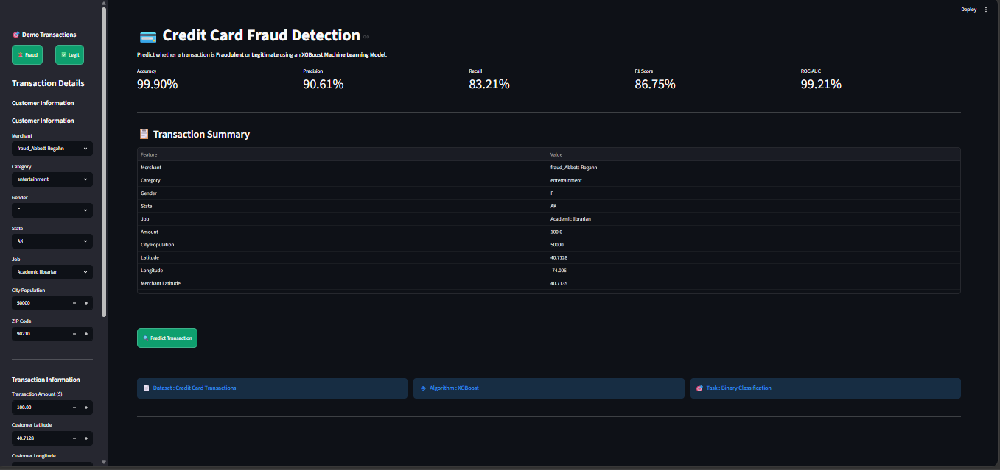
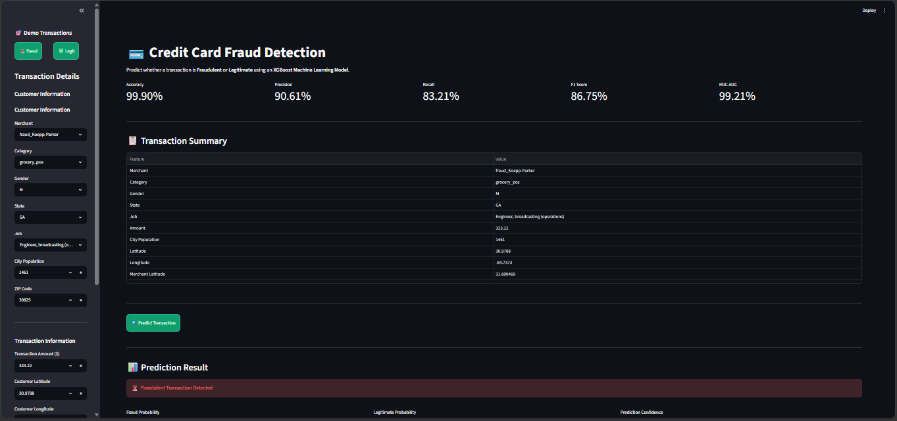
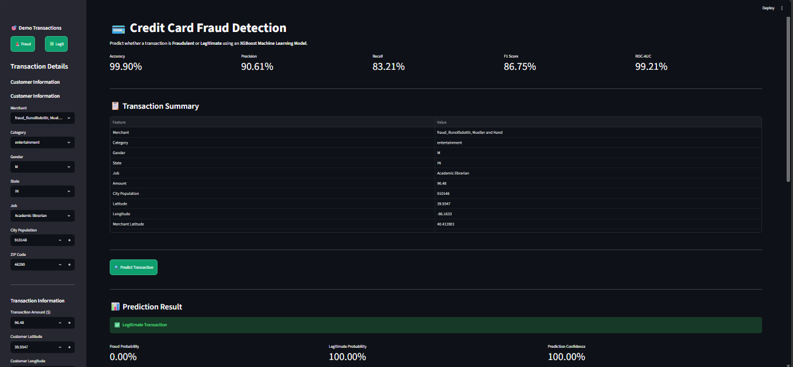

# 💳 Credit Card Fraud Detection using XGBoost

An end-to-end Machine Learning project that predicts whether a credit card transaction is **Fraudulent** or **Legitimate** using an **XGBoost Classifier**.

The project includes:

- Data preprocessing
- Feature engineering
- Multiple model comparison
- XGBoost training
- Model evaluation
- Streamlit deployment
- Professional interactive dashboard

---

## 🚀 Live Demo

🔗 **Live Demo:** https://cdsoft-wkyikh8aunhiqnwwxrnwta.streamlit.app/

---

## 📸 Project Screenshots

### Home Page



### Fraud Prediction



### Legitimate Prediction




---

# 📌 Problem Statement

Credit card fraud causes billions of dollars in financial losses every year.

This project uses Machine Learning to automatically classify transactions as:

- ✅ Legitimate
- 🚨 Fraudulent

helping financial institutions identify suspicious activities in real time.

---

# ✨ Features

- XGBoost Classifier
- Fraud Probability
- Risk Level Indicator
- Confidence Score
- Automatic Date & Time Processing
- Label Encoding
- Standard Scaling
- Interactive Streamlit Dashboard
- Demo Fraud Transactions
- Demo Legitimate Transactions

---

# 📂 Dataset

Dataset used:

Credit Card Fraud Detection Dataset

Target Variable:

```
is_fraud
```

Classes

```
0 → Legitimate

1 → Fraud
```

---

# ⚙️ Tech Stack

### Programming Language

- Python

### Machine Learning

- Scikit-Learn
- XGBoost

### Data Analysis

- Pandas
- NumPy

### Visualization

- Matplotlib
- Seaborn

### Deployment

- Streamlit

### Model Persistence

- Joblib

---

# 🧹 Data Preprocessing

The following preprocessing steps were performed:

- Removed unnecessary columns
- Label Encoding
- Feature Engineering
- Standard Scaling
- Train-Test Split
- Model Comparison

---

# 🤖 Models Compared

- Logistic Regression
- Decision Tree
- Random Forest
- Gradient Boosting
- XGBoost ✅

---

# 📊 Model Performance

| Metric | Score |
|---------|-------|
| Accuracy | 99.90% |
| Precision | 90.61% |
| Recall | 83.21% |
| F1 Score | 86.80% |
| ROC-AUC | 99.20% |

---

# 📈 Why XGBoost?

Among all the tested models, **XGBoost** achieved the highest:

- Recall
- F1 Score
- ROC-AUC

making it the most suitable model for fraud detection.

---

# 📁 Project Structure

```
Credit-Card-Fraud-Detection/

│

├── app.py

├── credit_card_detection.ipynb

├── model.pkl

├── scaler.pkl

├── encoders.pkl

├── fraud_sample.pkl

├── legitimate_sample.pkl

├── requirements.txt

├── README.md

├── images/

│ ├── home.png

│ ├── fraud_prediction.png

│ ├── legitimate_prediction.png

│ └── dashboard.png

└── dataset/
```

---

# ▶️ Installation

Clone the repository

```bash
git clone https://github.com/subhisharma409/CODSOFT/tree/main/Credit-Card-Fraud-Detection
```

Move into project

```bash
cd Credit-Card-Fraud-Detection
```

Install dependencies

```bash
pip install -r requirements.txt
```

Run Streamlit

```bash
streamlit run app.py
```

---

# 🎯 Future Improvements

- SHAP Explainability
- Cloud Deployment
- Database Integration
- User Authentication
- Real-time API Prediction
- Transaction History

---

# 👨‍💻 Author

**Subhi Sharma**

B.Tech (Artificial Intelligence & Machine Learning)

GitHub:

https://github.com/subhisharma409

LinkedIn:

https://www.linkedin.com/in/subhi-sharma/

---

⭐ If you found this project useful, please consider giving it a **Star**.
