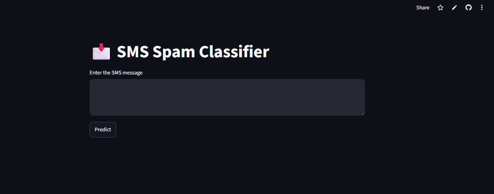
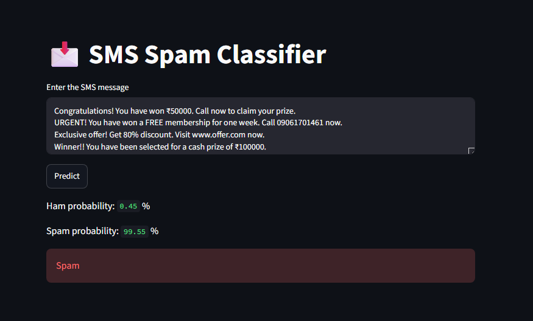
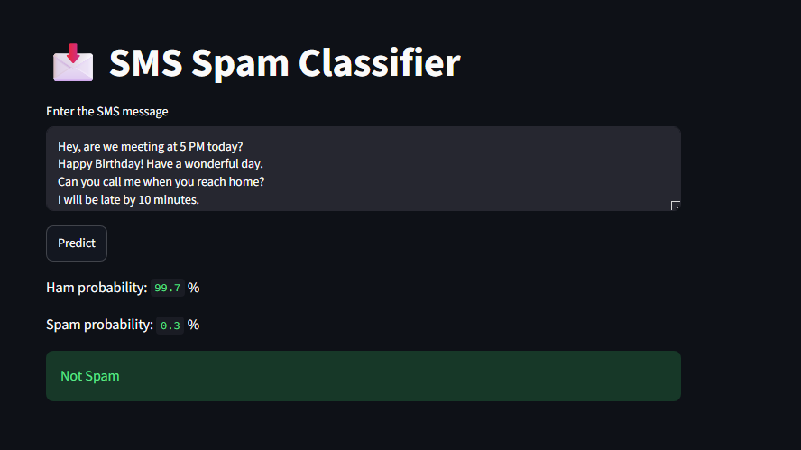

# 📩 SMS Spam Detection using Machine Learning

A Machine Learning web application that classifies SMS messages as **Spam** or **Not Spam (Ham)** using Natural Language Processing (NLP) and the Multinomial Naive Bayes algorithm.

## 🚀 Live Demo

🌐 **Live App:** [SMS Spam Classifier](https://codsoft-gwh8cxygznrc9nxhq37gqg.streamlit.app/)


## 📸 Project Screenshots

### Home Page



### Fraud Prediction



### Legitimate Prediction




---

## 📌 Features

- SMS classification into Spam or Ham
- Text preprocessing using NLP
- TF-IDF Vectorization
- Multinomial Naive Bayes classifier
- Streamlit web interface
- Prediction probabilities
- Fast and lightweight model

---

## 🛠️ Technologies Used

- Python
- Pandas
- NumPy
- Matplotlib
- Seaborn
- NLTK
- Scikit-Learn
- Streamlit
- Pickle

---

## 📂 Project Structure

```text
SMS-Spam-Detection/
│
├── app.py
├── model.pkl
├── vectorizer.pkl
├── spam.csv
├── SMS_Spam_Detection.ipynb
├── requirements.txt
├── README.md
└── screenshots/
```

---

## ⚙️ Machine Learning Pipeline

```text
Data Collection
       ↓
Data Cleaning
       ↓
Exploratory Data Analysis
       ↓
Word Cloud Visualization
       ↓
Text Preprocessing
       ↓
TF-IDF Vectorization
       ↓
Train-Test Split
       ↓
Multinomial Naive Bayes
       ↓
Model Evaluation
       ↓
Streamlit Deployment
```

---

## 🧠 NLP Preprocessing

The following preprocessing steps are applied:

- Convert text to lowercase
- Tokenization
- Remove stopwords
- Remove punctuation
- Stemming using PorterStemmer
- URL handling
- Email handling
- Currency symbol handling

---

## 📊 Model Used

### Multinomial Naive Bayes

Evaluation Metrics:

- Accuracy Score
- Precision Score
- Confusion Matrix

Multinomial Naive Bayes achieved the best performance among the tested models.

---

## 📸 Sample Predictions

### Spam

Input:

```text
Congratulations! You have won a FREE lottery worth ₹50000. Call now to claim your prize.
```

Prediction:

```text
Spam
```

---

### Ham

Input:

```text
Hey, are we meeting at 5 pm today?
```

Prediction:

```text
Not Spam
```

---

## 📚 Libraries Used

```python
pandas
numpy
matplotlib
seaborn
nltk
scikit-learn
streamlit
pickle
```

---

## 📈 Future Improvements

- Deep Learning with LSTM
- Word Embeddings
- BERT-based Spam Detection
- Multilingual SMS classification
- Enhanced UI
- Email spam detection

---

## 🤝 Acknowledgements

- CampusX
- Scikit-Learn Documentation
- NLTK Documentation
- Streamlit Documentation

---

## 👨‍💻 Author

**Subhi Sharma**

B.Tech CSE (AI & ML)

GitHub:
https://github.com/subhisharma409

LinkedIn:
[Subhi-Sharma](https://www.linkedin.com/in/subhi-sharma/)

---

⭐ If you found this project useful, consider giving it a star!
